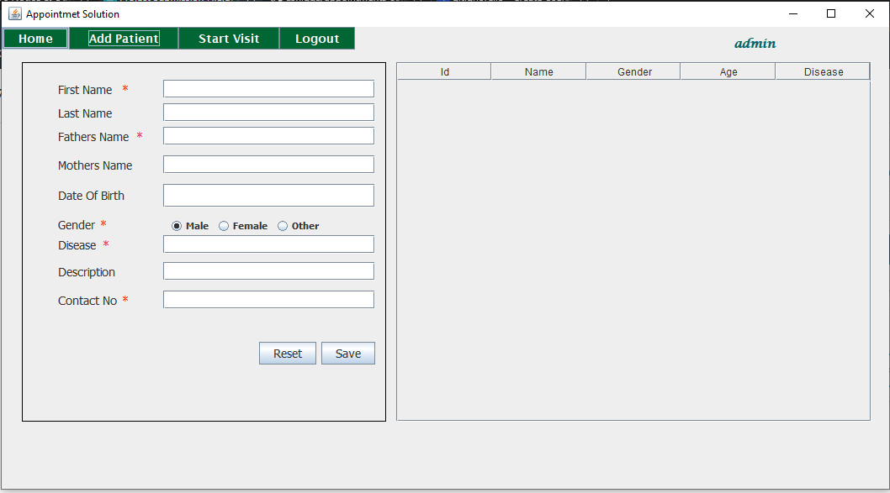
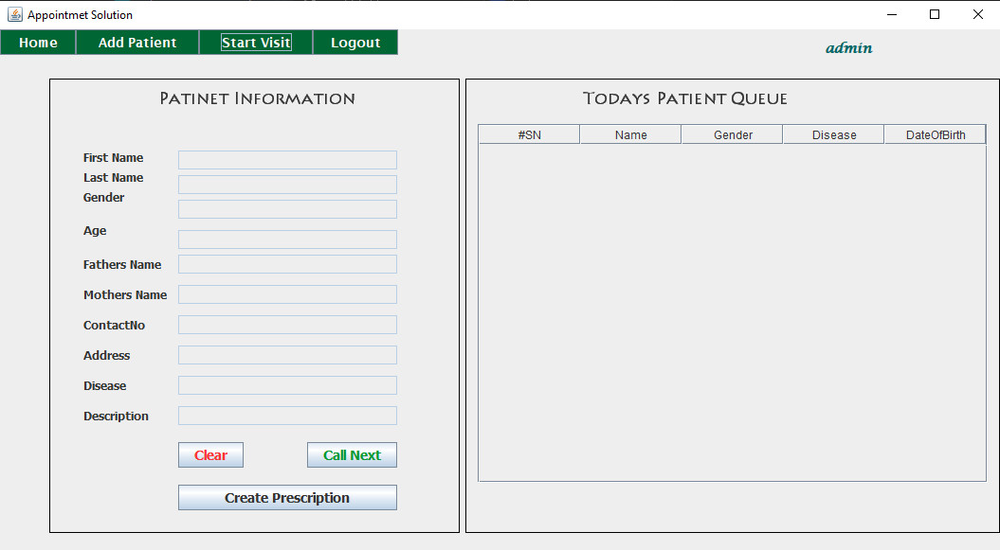

# appointments-solution
This is a simple appointment solution. A doctor can manage his/her patient queue by this software. Here I tried to implement all OOP concept which I learn from my 6 semester OOP course. This is all about my semester final project.

